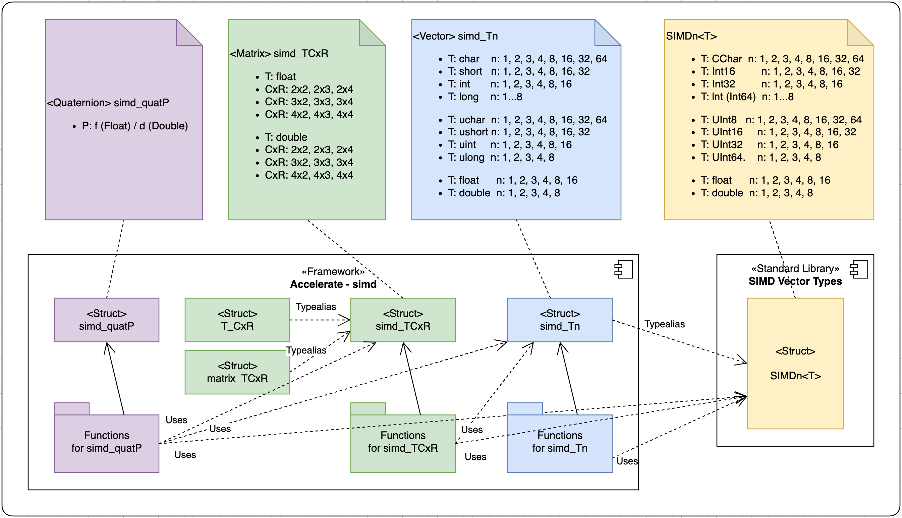
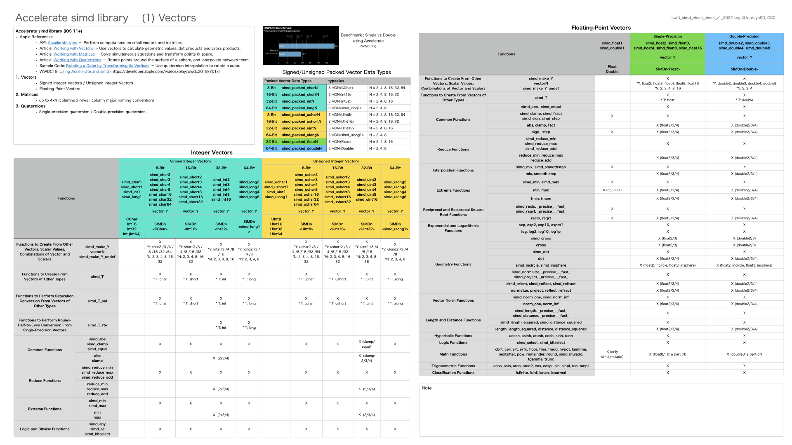

# Swift SIMD Type Cheat Sheet

In Swift, you can handle vectors, matrices, and quaternions,   ​​using the standard library SIMD vector types
 and the Accelerate simd library.
They are related as shown in the figure below.

This cheat sheet shows an overview and sample code for each type.

- download `Swift SIMD Type Cheat Sheat`: [PDF](pdf/swift_vector_cheat_sheet.pdf "Cheat Sheat PDF file")

## SIMD Vector Types

The SIMD Vector Types were added in Swift 5 Standard Library.
They consist of `SIMD2<Scalar>, SIMD3<Scalar>, SIMD4<Scalar>, SIMD8<Scalar>,
SIMD16<Scalar>, SIMD32<Scalar>`, and `SIMD64<Scalar>`.
The `Scalar` is a type conforming to the `SIMDScalar` protocol,
such as `Double, Float, Float16, Int, Int8, Int16, Int32, Int64,
UInt, UInt8, UInt16, UInt32`, and `UInt64`.
The `SIMD` protocol defines properties, methods, and operators
for a SIMD vector of a fixed number of elements.

The cheat sheet shows the definition of each type and protocol,
as well as sample code.

Sample Code:

- Swift Playground Code [Gist](https://gist.github.com/ynagatomo/b55dae8a1e4b7817ce4e9d90fda68b0d "simd_vector.playground")

References:

- Apple Documentation [SIMD Vector Types](https://developer.apple.com/documentation/swift/swift_standard_library/numbers_and_basic_values/simd_vector_types)
- Swift-evolution [SE-0229 SIMD Vectors](https://github.com/apple/swift-evolution/blob/master/proposals/0229-simd.md)

## Accelerate simd library - Vectors

It provides Signed Integer Vectors, Unsigned Integer Vectors,
and Floating-Point Vectors.
Since simd types are typealias of Standard Library SIMD types, you can take advantage of SIMD type functions.

The cheat sheet shows the types and functions which can be used on the types, as well as sample code.

Sample Code:
- Swift Playground [Gist](https://gist.github.com/ynagatomo/785049721bc043fe12a783e77dff8a98)

References:
- Apple Documentation, Accelerate [simd](https://developer.apple.com/documentation/accelerate/simd)
- Apple Documentation, Article [Working with Vectors](https://developer.apple.com/documentation/accelerate/working_with_vectors)
- Apple WWDC18 Video [Using Accelerate and simd](https://developer.apple.com/videos/play/wwdc2018/701/)

## Accelerate simd Library - Matrices

It provides Single-Precision Floating-Point Matrices and
Double-Precision Floating-Point Matrices.
The Matrices are up to 4 columns x 4 rows.
(column major naming convention)

The cheat sheet shows the types and functions which can be used on the types, as well as sample code.

Sample Code:
- Swift Playground [Gist](https://gist.github.com/ynagatomo/695f5f8c8392d133642405d7364c67dc)

References:
- Apple Documentation, Article [Working with Matrices](https://developer.apple.com/documentation/accelerate/working_with_matrices)

## Accelerate simd Library - Quaternions

It provides Single-Precision Quaternion Type `simd_quatf`
and Double-Precision Quaternion Type `simd_quatd`.

Quaternions

- Quaternions are defined by a scalar (real) part, and three imaginary parts collectively called the vector part. Quaternions are often used in graphics programming as a compact representation of the rotation of an object in three dimensions.
- The length of a quaternion is the square root of the sum of the squares of its components.
- Quaternions rotate points around the surface of a sphere, and interpolate between them.
- Quaternions have some advantages over matrices. For example, they're smaller: A 3 x 3 matrix of floats is 48 bytes, and a single-precision quaternion is 16 bytes. They also can offer better performance: Although a single rotation using a quaternion is a little slower than one using a matrix, when combining actions, quaternions can be up to 30% faster.

Sample Code:
- Swift Playground [Gist](https://gist.github.com/ynagatomo/17c092e6c5357e44c5d5d0cdf85a06f0)

References:
- Apple Documentation, Article [Working with Quaternions](https://developer.apple.com/documentation/accelerate/working_with_quaternions)
- Apple Sample Code [Rotating a Cube by Transforming Its Vertices](https://developer.apple.com/documentation/accelerate/rotating_a_cube_by_transforming_its_vertices)

License: CC0
